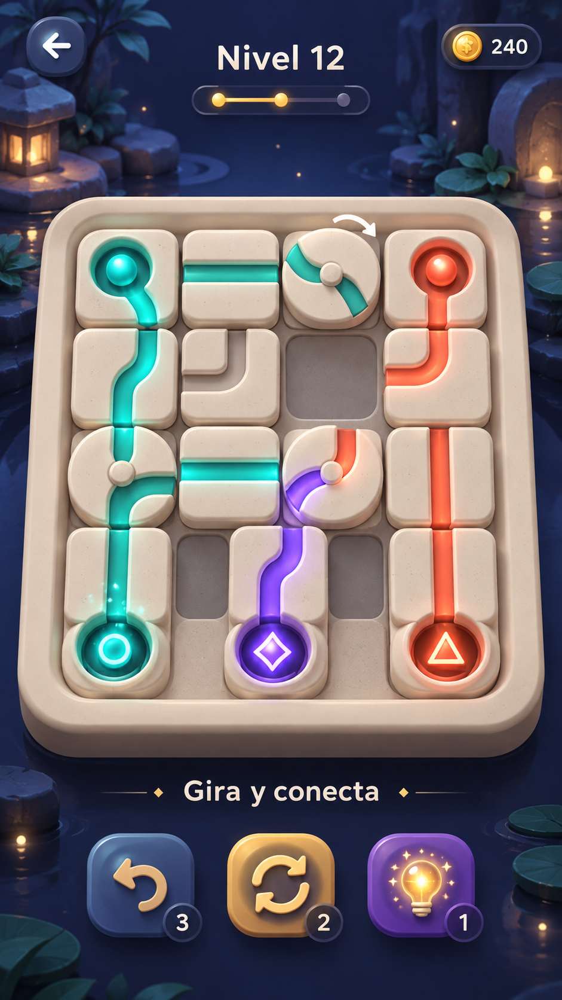
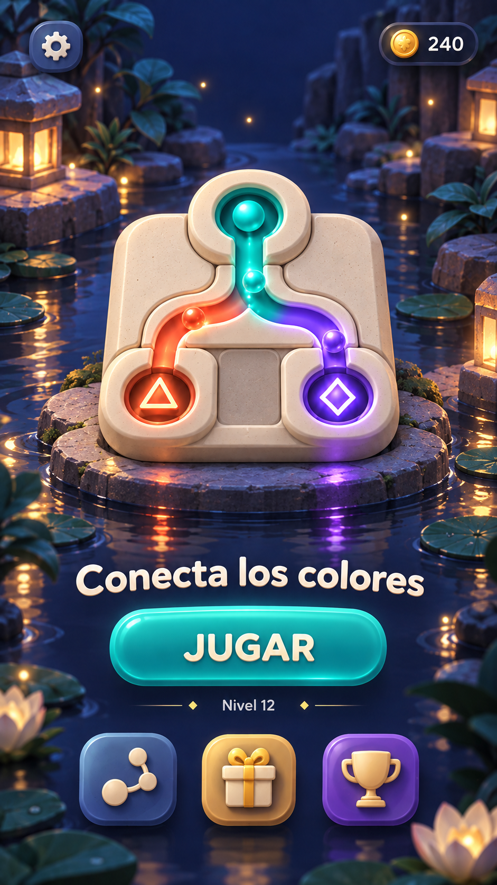
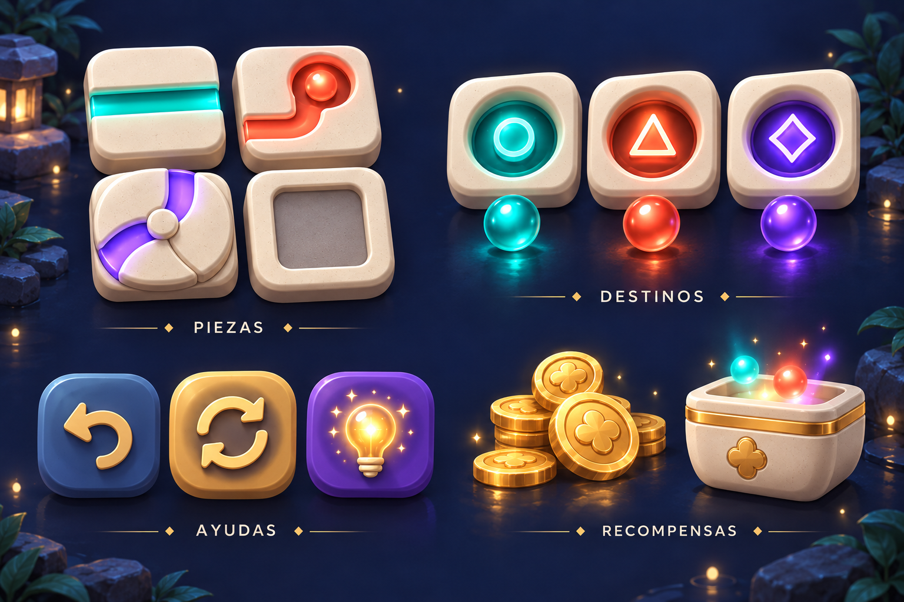

# Primera propuesta visual

Fecha: 8 de octubre de 2026 (America/Chicago).

Exploración visual para el juego Android original del proyecto. Son imágenes de concepto generadas con la herramienta integrada de generación de imágenes; no son capturas de un juego implementado, niveles validados ni sprites finales listos para producción. La mecánica, el nombre y el motor siguen pendientes de definición.

## Dirección artística

Cerámica marfil, canales luminosos, piezas redondeadas y un jardín nocturno de fondo. Tres familias de color (turquesa, coral y violeta) acompañadas de símbolos (círculo, triángulo y rombo) para distinguir destinos también por su forma. Interfaz vertical, botones grandes y una estética táctil de apariencia 2.5D.

Como hipótesis visual se representa un puzle de girar piezas y conectar rutas para llevar esferas a su destino. Esta exploración no fija todavía las reglas del juego. Los trazados dibujados y los valores de nivel, monedas y ayudas son ilustrativos.

## Imágenes

### Partida

### Menú principal

### Piezas, destinos, ayudas y recompensas

## Procedencia y continuidad

- Generación: herramienta integrada de imágenes; no se utilizó el modo CLI.
- La primera imagen se generó a partir de texto. Las otras dos utilizaron esa primera imagen como referencia de estilo.
- Los prompts completos se conservan en [prompts.md](prompts.md).
- Los PNG conservan las salidas originales, sin edición posterior.
- No se han usado capturas ni recursos de Pixel Flow! como imágenes de referencia.
- Las próximas variantes deben conservarse con nombres o carpetas nuevos para mantener esta propuesta.
