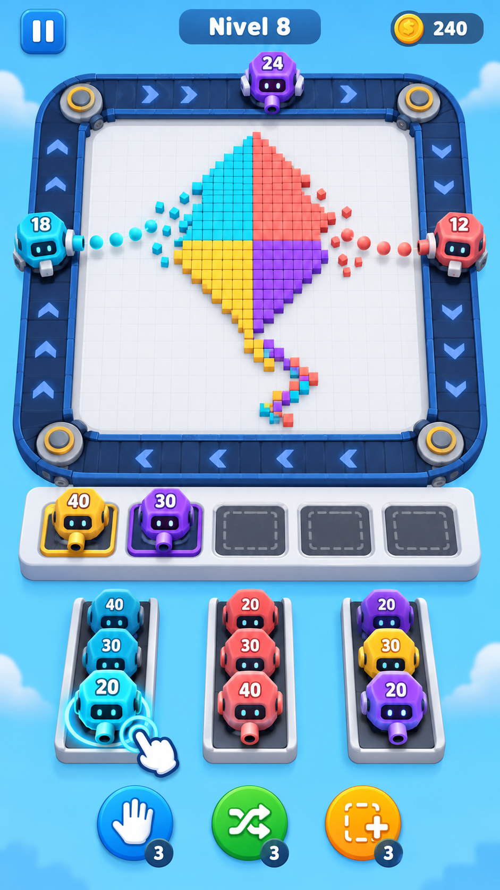
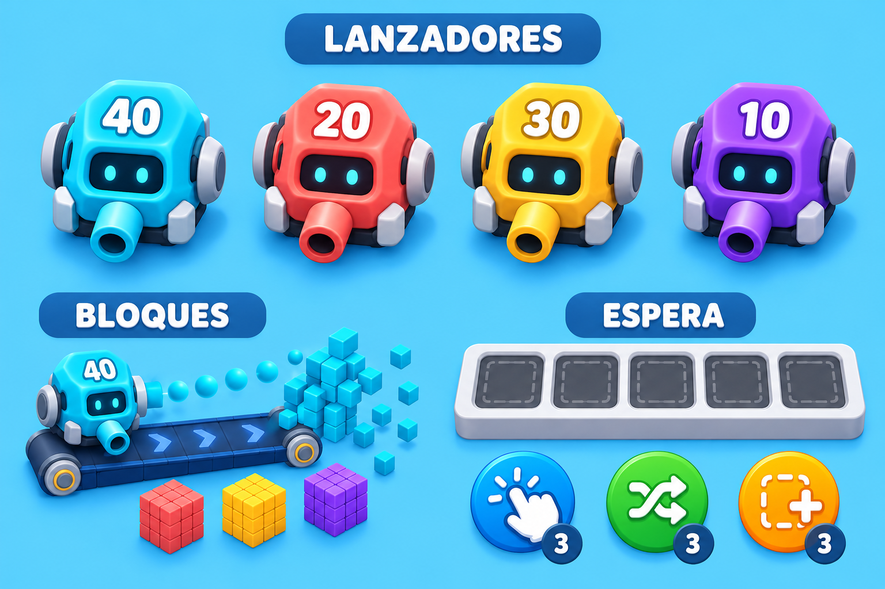

# Propuesta visual corregida: puzle de disparadores y cinta

Fecha: 8 de octubre de 2026 (America/Chicago).

## Corrección de dirección

El propietario rechazó la primera propuesta porque representaba un puzle de tuberías. Los tres PNG y sus documentos se retiraron de la versión actual del repositorio en el commit f88e2f086b1850f3e60b8540428f186712b0dc13. Este conjunto reemplaza aquella dirección artística.

La referencia mecánica correcta es un puzle de gestión de colas: seleccionar lanzadores con munición limitada, enviarlos a una cinta alrededor de una figura de bloques y destruir objetivos de su mismo color. La identidad visual propuesta utiliza pequeños robots originales y un patrón de cometa propio. El nombre del juego y las reglas diferenciadoras siguen pendientes; no se afirma que cambiar personajes sea, por sí solo, una mecánica nueva.

## Evidencia revisada

Referencia principal: vídeo adjuntado por el propietario, video_2026-10-08_23-36-45(1).mp4 (64,77 segundos). Se inspeccionaron fotogramas de 0 a 64 segundos, incluidos detalles de 00:32 y 00:44.

- 00:00–00:24: figura central compuesta por muchos bloques pequeños; lanzadores que recorren la cinta y disparan hacia dentro; sus números de munición disminuyen y los bloques desaparecen.
- 00:28: recompensa de 40 monedas al completar el primer nivel.
- 00:32: el tutorial indica expresamente que cinco personajes pueden viajar en la cinta al mismo tiempo.
- Hay además cinco huecos de espera debajo de la cinta. La capacidad de circulación y el almacenamiento temporal son dos límites diferentes.
- 00:44: un lanzador amarillo con 40 de munición está aparcado en el primer hueco mientras uno violeta con 39 sigue en la cinta. Las colas pendientes aparecen más abajo.
- El clip permite observar la victoria y la circulación; no muestra una derrota. No se considera verificada aquí la condición exacta de pérdida.

Contraste público, consultado el 8 de octubre de 2026:

- [Ficha oficial de Google Play](https://play.google.com/store/apps/details?id=com.loomgames.pixelflow): confirma toque para lanzar, disparo por color, munición, capacidad de cinta, cinco huecos de espera y relanzamiento.
- [Partida pública de Loom Games en iOS](https://www.youtube.com/watch?v=0YeeZmKl1eY): analizada visualmente mediante vidIQ antes de recibir el vídeo del propietario; referencia complementaria. La referencia directa del propietario tiene prioridad para esta corrección.

No se han incluido el vídeo de referencia ni capturas de terceros como recursos del juego.

## Imágenes originales

### Concepto de partida

### Lanzadores, bloques y espera

Estas imágenes son arte conceptual generado, no capturas de software implementado ni recursos recortados y listos para producción. Los números, el nivel y los potenciadores ilustran la propuesta; no validan una economía ni un nivel resoluble. La disposición exacta de las colas, sus cabeceras seleccionables y las conexiones de entrada/salida deberán fijarse en un prototipo funcional.

## Procedencia

Generación mediante la herramienta integrada de imágenes, sin CLI. La primera imagen parte de texto fundamentado en la referencia investigada. La segunda usa la primera como referencia visual. Los prompts completos están en [prompts.md](prompts.md). No se copiaron logotipos, personajes ni niveles exactos de Pixel Flow!.
