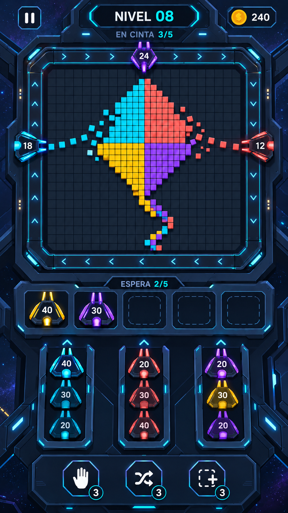

# Dirección futurista: estación orbital

8 de octubre de 2026 (America/Chicago).

Última dirección solicitada por el propietario: conservar el juego de píxeles cuadrados y la mecánica de lanzadores, renovar los lanzadores y ambientar la pantalla en un entorno claramente futurista, manteniendo una implementación sencilla.

## Propuesta

Naves angulares pequeñas como lanzadores; raíl magnético luminoso que rodea el tablero; plataforma tecnológica oscura con bordes cian; cinco bahías de espera y tres colas de lanzamiento. Los números de munición siguen siendo visibles y los colores de cada unidad corresponden a los bloques que puede destruir.

Se conserva la estructura de juego revisada en el vídeo del propietario: mosaico central, circulación periférica, disparo automático por color, munición y gestión de espacio. Los indicadores de cinta y espera son independientes. No se ha implementado todavía el juego ni validado el nivel ilustrado.

## Construcción sencilla en 2D

| Elemento | Recurso reutilizable |
| --- | --- |
| Bloques | Un cuadrado tintado y una matriz de celdas por nivel. |
| Naves | Una silueta triangular/trapezoidal con acentos de color; munición en texto independiente. Rotar el cuerpo hacia el centro manteniendo el número legible. |
| Raíl | Una trayectoria cuadrada con esquinas achaflanadas y marcas repetidas. |
| Marco de estación | Paneles 2D modulares y bordes luminosos; no requiere construir una estación en 3D. |
| Fondo espacial | Una capa estática de estrellas, independiente del tablero. |
| Disparos e impactos | Cuadrados pequeños de color y animaciones breves de escala/opacidad. |
| Controles | Iconos sencillos sobre paneles angulares con áreas táctiles amplias. |

Los relieves, reflejos y acentos luminosos del concepto pueden simplificarse o prerenderizarse en sprites. El movimiento, la munición y los bloques deben ser elementos independientes, no una única captura de fondo. Esta estrategia reduce la cantidad de recursos diferentes necesarios; el rendimiento deberá comprobarse en un prototipo Android.

## Archivos

- [01-partida-futurista.png](01-partida-futurista.png): propuesta vigente de esta iteración.
- [design-tokens.json](design-tokens.json): paleta objetivo y parámetros visuales propuestos.
- [prompts.md](prompts.md): prompts completos de ambas etapas.
- [exploraciones/01-modernizacion-inicial.png](exploraciones/01-modernizacion-inicial.png): paso intermedio previo a la petición de una ambientación más futurista, conservado para no perder el trabajo.

## Procedencia

Ambas imágenes se generaron con la herramienta integrada de imágenes en modo de edición, sin CLI. La modernización inicial usó la partida v2 como referencia. La propuesta futurista editó aquella modernización para cambiar todas las unidades y la ambientación. Los gráficos son conceptos y aún requieren separación o reconstrucción como recursos de producción. No se han elegido definitivamente el motor, el nombre ni las reglas diferenciadoras del juego.
