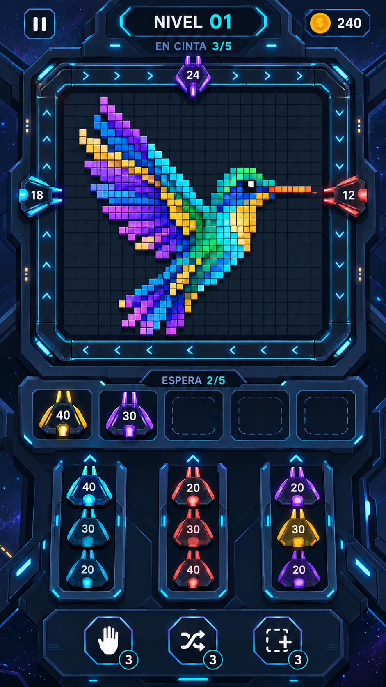
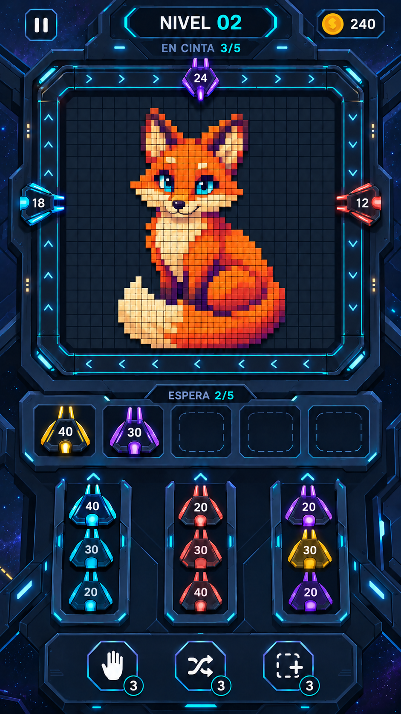
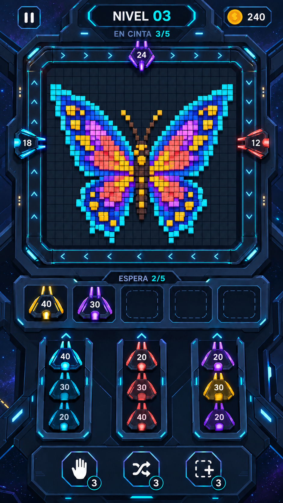
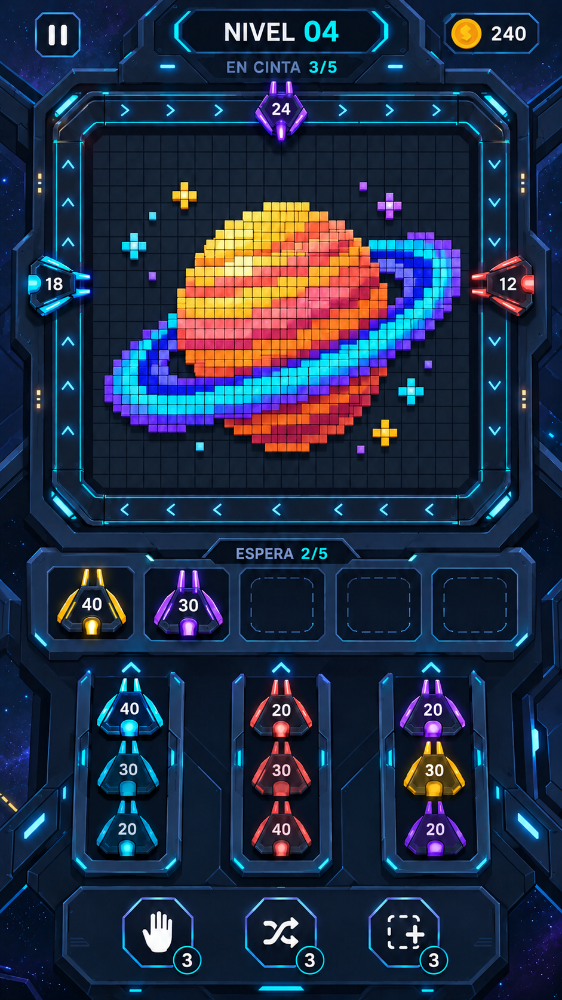
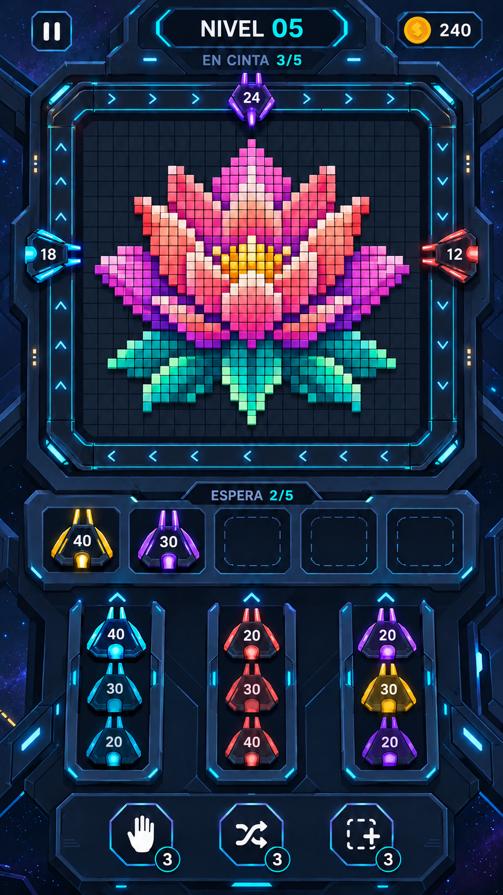

# Cinco figuras de píxeles para el tablero

Propuestas artísticas del 8 de octubre de 2026 (America/Chicago). Cada imagen conserva el escenario futurista y muestra una figura distinta construida visualmente con bloques cuadrados.

## Colibrí

## Zorro

## Mariposa

## Planeta con anillos

## Flor

## Uso previsto

Son conceptos visuales, no niveles ya programados. Los números de nivel identifican los ejemplos. Para convertirlos en niveles habrá que reconstruir cada figura como matriz de celdas, limitar y asignar sus colores lógicos, adaptar las colas y la munición, y comprobar que puede resolverse. Los matices artísticos de iluminación pueden compartir un mismo color lógico para evitar que cada sombra exija otro tipo de lanzador.

Los lanzadores y contadores conservados en las imágenes son referencias de interfaz; todavía no están equilibrados con la cantidad y los colores de los bloques de cada figura.

## Procedencia

Cinco ediciones independientes mediante la herramienta integrada de generación de imágenes, sin CLI, usando la pantalla futurista v3 como referencia común. Los prompts completos se conservan en [prompts.md](prompts.md). Las imágenes originales se guardan sin modificación posterior.
