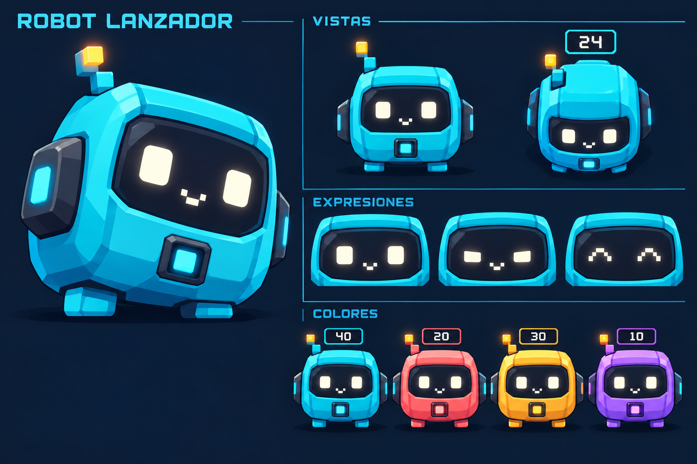
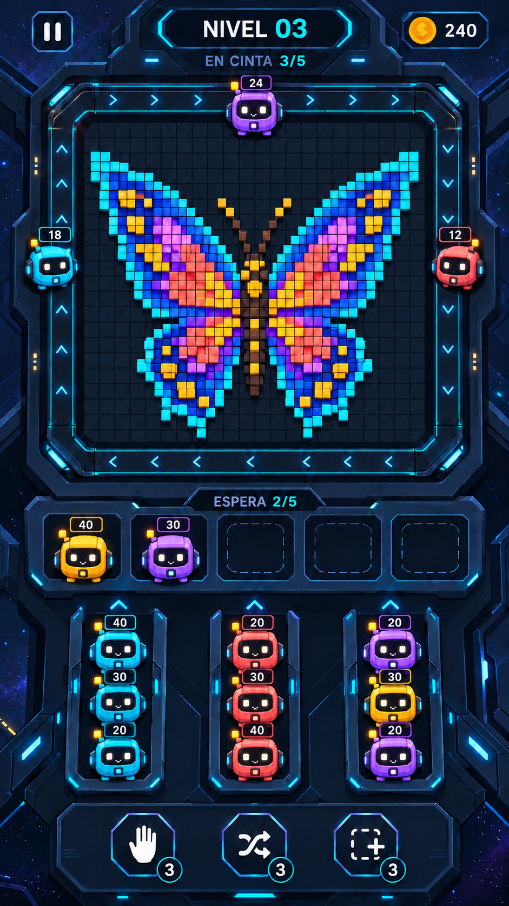

# Robot lanzador: personaje original, propuesta v1

8 de octubre de 2026 (America/Chicago). Diseño solicitado por el propietario: sustituir las unidades abstractas por un robotito moderno con personalidad y fácil de llevar a un juego 2D. No se ha elegido aún su nombre definitivo.

## Diseño del personaje

Rasgos principales: cuerpo compacto y cuadrado con esquinas suaves, visor oscuro con dos ojos digitales, pequeña sonrisa de píxeles, antena escalonada con indicador ámbar y emisor de energía cuadrado en el pecho. Los pies son mínimos y los laterales son paneles fijos. La personalidad propuesta es curiosa, atenta y alegre.

La carcasa cambia entre cian, coral, ámbar y violeta según el color de disparo. La silueta y el rostro permanecen constantes. La cifra de munición es una etiqueta independiente que no tapa la cara.

## Dentro del juego

La captura conceptual muestra el personaje en el raíl, en las bahías de espera y en las colas. Conserva la mariposa de píxeles y la estación futurista. Es una propuesta visual, no una captura de un juego ejecutándose.

## Implementación sencilla propuesta

Usar un sprite base de cuerpo y un conjunto pequeño de expresiones de visor. La carcasa puede tener una máscara de color para reutilizar la misma forma; el visor, la antena y la etiqueta de munición se mantienen separados. En 2D se puede dar vida al personaje con cambios de escala, pequeñas inclinaciones, parpadeo y desplazamientos cortos, sin animación esquelética ni un modelo 3D.

| Estado | Gesto propuesto |
| --- | --- |
| Espera | Parpadeo ocasional y leve oscilación. |
| Selección | Ojos atentos y pequeño rebote. |
| Disparo | Ojos concentrados, pulso en el emisor y retroceso breve. |
| Munición agotada | Apagar el emisor y retirar la unidad con una animación corta. |
| Victoria | Ojos alegres y un pequeño salto. |

El número de munición y las áreas táctiles deben seguir siendo legibles a tamaño real de móvil. La orientación del emisor y los fotogramas direccionales se ajustarán al prototipo. Estas láminas aún deben transformarse en sprites separados; no son una hoja de sprites lista para importar. No se ha medido rendimiento.

## Procedencia y archivos

- [01-diseno-personaje.png](01-diseno-personaje.png): diseño nuevo a partir de texto.
- [02-en-el-juego.png](02-en-el-juego.png): edición de la pantalla de la mariposa usando el diseño del personaje como referencia.
- [prompts.md](prompts.md): prompts completos y papeles de las referencias.

Ambos resultados se produjeron con la herramienta integrada de generación de imágenes, sin CLI. El personaje sustituye visualmente a las naves de la iteración anterior; se conserva el historial de propuestas.
