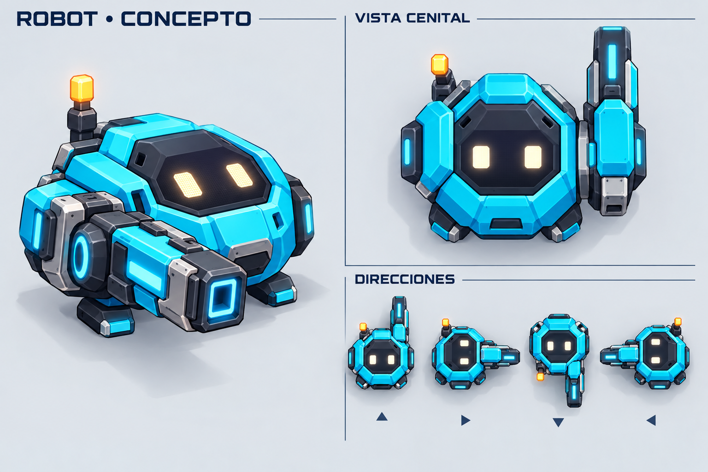

# Robot con cañón — diseño v2

9 de octubre de 2026 (America/Chicago).

El propietario pidió rehacer el personaje con un aspecto más moderno y un cañón claramente visible. También indicó que primero se diseñe el personaje y que su futura presentación dentro del juego utilice una vista desde arriba. Esta iteración contiene únicamente la ficha de diseño; no se ha creado una nueva integración en el tablero.

## Dirección propuesta

- Cuerpo compacto y facetado, con armadura cian, chasis grafito y detalles claros.
- Visor digital en la cubierta superior para conservar expresión y legibilidad desde arriba.
- Antena escalonada e indicador ámbar como rasgo reconocible.
- Cañón de energía lateral que sobresale hacia delante, con una boca de salida visible y una silueta que indica la dirección de disparo.
- Paneles laterales y apoyos cortos; pocos elementos móviles.

La vista de tres cuartos sirve para estudiar el personaje. La vista cenital es la referencia para desarrollar el recurso del juego. Las cuatro miniaturas representan orientaciones de esa vista superior, no vistas frontales alternativas.

## Preparación futura como recurso 2D

Separar cuerpo, cañón y visor en capas o sprites. El cañón puede hacer un retroceso corto sin requerir animación de brazos. Las expresiones pueden resolverse cambiando los píxeles de los ojos. La cifra de munición será texto de interfaz independiente y debe permanecer legible cuando gire el personaje.

Para producción, obtener las orientaciones a partir de una misma geometría o sprite cenital para asegurar consistencia. Las miniaturas generadas son referencias conceptuales; no constituyen un atlas de rotaciones exactas. Los pequeños detalles de armadura podrán reducirse al probar el tamaño real en móvil. No se han generado todavía sprites recortados, animaciones finales ni código del personaje.

## Procedencia

Editado con la herramienta integrada de generación de imágenes, usando la ficha del robot v1 como referencia de rediseño. No se utilizó CLI. [Prompt completo](prompt.md).

La versión anterior se conserva en el historial del proyecto; esta ficha refleja la corrección más reciente del propietario.
