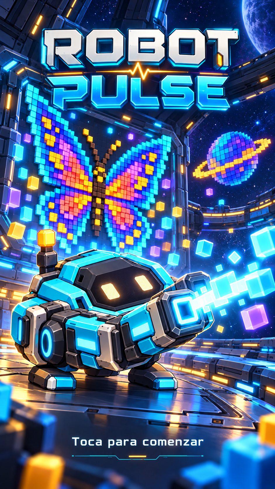

# Robot Pulse — arte de apertura

9 de octubre de 2026 (America/Chicago).

El propietario eligió el nombre **Robot Pulse**, con la palabra Robot completa, y pidió una imagen épica para la apertura del juego.

## Composición

Logo ROBOT PULSE, robot aprobado con cañón de energía en primer plano, figuras de mariposa y planeta construidas con cuadrados de colores y un entorno de estación orbital. El texto inferior dice «Toca para comenzar».

Es arte vertical de presentación. El personaje se muestra en tres cuartos para la composición del título; la vista cenital sigue siendo la referencia para su futura representación durante las partidas.

## Uso previsto

Puede servir como referencia de una pantalla de título interna del juego. Al implementarla se podrá utilizar una imagen estática prerenderizada, sin recrear toda la escena en 3D. Conviene separar después fondo, logo y texto/área de interacción para adaptar proporciones, zonas seguras e idiomas. El PNG actual es una ilustración completa; no contiene botones funcionales, capas editables ni animación.

## Procedencia

Creado con la herramienta integrada de generación de imágenes, sin CLI. Referencias: ficha aprobada del robot con cañón v2 (identidad del personaje) y pantalla de la mariposa (figuras de píxeles y ambiente futurista). No se copiarán los textos ni controles de esas referencias en la apertura.

El [prompt completo](prompt.md) permite continuar esta dirección artística. El nombre elegido se registra también en el README principal del repositorio.
