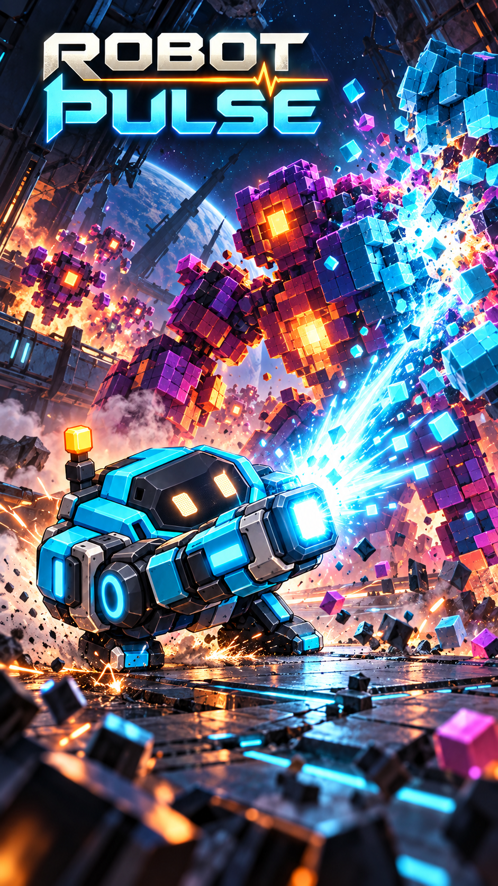

# Robot Pulse — apertura de acción v2

9 de octubre de 2026 (America/Chicago).

Nueva propuesta solicitada por el propietario: una ilustración cinematográfica del robot en combate, disparando contra construcciones enemigas de píxeles. Sustituye como referencia actual a la composición anterior de figuras de muestra.

## Dirección artística

El robot aprobado aparece en primer plano, apoyado sobre sus patas y disparando su cañón. Un enemigo grande construido con cubos se desintegra en el punto de impacto; otras amenazas de píxeles crean profundidad. La escena transcurre en una estación orbital dañada, con iluminación cian y ámbar, chispas y fragmentos cuadrados. El título ROBOT PULSE encabeza la composición.

Es una ilustración narrativa para la presentación del juego. La imagen permite explorar el universo visual del personaje; la mecánica de puzles definida hasta ahora se conserva. La integración como pantalla interna puede utilizar una imagen estática, manteniendo el futuro logo y los controles en capas independientes si se requiere adaptación a otros formatos.

## Procedencia

Generada con la herramienta integrada de imágenes, sin CLI, usando únicamente la ficha aprobada del robot con cañón v2 como referencia de identidad. La composición es nueva. No se usó la apertura anterior ni las figuras de muestra como referencias visuales.

[Prompt completo](prompt.md). La versión anterior queda conservada como una iteración previa del diseño.
