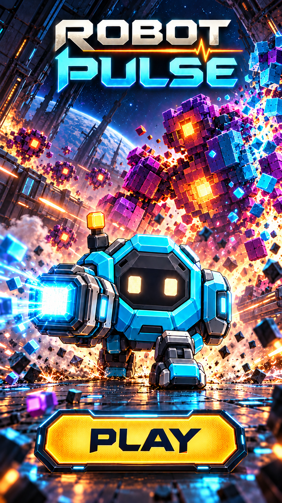

# Robot Pulse — pantalla inicial con PLAY

9 de octubre de 2026 (America/Chicago).

El propietario pidió mantener la batalla contra monstruos pixelados, presentar al robot erguido y avanzando hacia el espectador, e incorporar un botón de jugar. También fijó el inglés como idioma principal del juego y el español como traducción.

## Dirección de esta iteración

Robot en primer plano, pose frontal de avance, cara visible, un solo cañón disparando hacia un lateral y monstruos construidos con cubos al fondo. El título ROBOT PULSE ocupa la parte superior y el botón PLAY queda separado de la acción en la zona inferior. Se corrigió una segunda arma que apareció durante la generación inicial para conservar la identidad del personaje.

## Idiomas

| Elemento | Inglés, idioma principal | Español |
| --- | --- | --- |
| Nombre | Robot Pulse | Robot Pulse |
| Acción principal | PLAY | JUGAR |

Los textos se conservan también en [ui-text.json](ui-text.json) como propuesta inicial de localización. No se ha implementado todavía un selector de idioma.

## Integración futura

El PNG es un diseño visual completo. Para implementar la pantalla, separar el arte de fondo, el logo y el botón real: así la etiqueta podrá cambiar entre PLAY y JUGAR y el área táctil se adaptará a cada teléfono. El botón dibujado en esta imagen no contiene interacción. La ilustración puede mostrarse como recurso 2D prerenderizado; no requiere recrear la batalla en 3D en tiempo real.

## Procedencia

Herramienta integrada de generación de imágenes, sin CLI. Referencias: portada de acción v2 para atmósfera y ficha del robot con cañón v2 para identidad. Después se realizó una corrección localizada del arma adicional. Los dos prompts están en [prompts.md](prompts.md). Esta imagen es la referencia actual de la pantalla inicial; las propuestas anteriores se conservan como historial.
