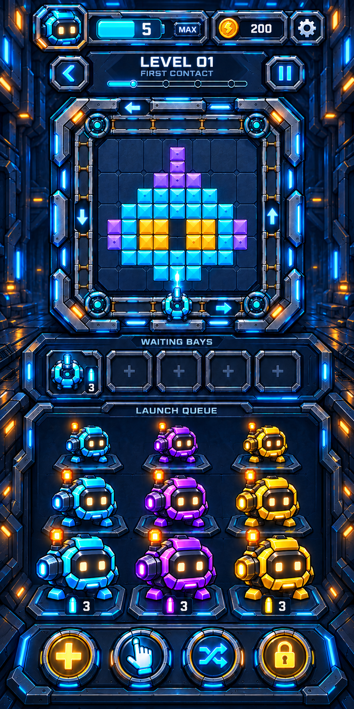

# Robot Pulse — recursos de partida y ventanas

Paquete gráfico del 9 de octubre de 2026, preparado a partir de las correcciones del propietario y del video de referencia. Son recursos y propuestas visuales nuevos; no son capturas de una APK actualizada. La integración en el juego y su comprobación en teléfono quedan pendientes.

## Ver los diseños

- [Nivel 1: tres columnas y tres filas, bandejas, disparo y herramientas](previews/level-01.png)
- [Robot visto desde arriba: bandeja y disparo hacia el tablero](previews/robot-bay-and-shot.png)
- [Configuración con batería horizontal](previews/settings.png)
- [Añadir bandeja, seleccionar y mezclar](previews/boosters.png)
- [Compra, información del ranking y energía](previews/utility-dialogs.png)
- [Victoria, pausa y derrota](previews/results-pause.png)
- [Máster: podios de meses anteriores](previews/leaderboard-master.png)

## Recursos reutilizables

| Archivo | Contenido |
| --- | --- |
| [robots-atlas.png](assets/robots-atlas.png) | 9 vistas: cian, violeta y ámbar; cola, cenital y disparo. |
| [controls-atlas.png](assets/controls-atlas.png) | 12 controles vacíos: botones y estados, bandeja, marco circular, batería, barra y placa de munición. |
| [icons-atlas.png](assets/icons-atlas.png) | 16 iconos: bandeja extra, selección, mezcla, candado, configuración, sonido, música, idioma, atrás, pausa, reproducir, cerrar, trofeo, moneda, estrella y cofre. |
| [arena-plate.png](assets/arena-plate.png) | Estructura y cinta vacías; campo interior oscuro, sin flechas, robots ni bloques incrustados. |
| [modal-frames-atlas.png](assets/modal-frames-atlas.png) | 3 marcos reutilizables de información, configuración y recompensa. |
| [tiles-fx-atlas.png](assets/tiles-fx-atlas.png) | 12 elementos: bloque, proyectil, destello e impacto en tres colores. |
| [hud-states-atlas.png](assets/hud-states-atlas.png) | 8 piezas: batería llena/baja, interruptor activado/desactivado, pestaña seleccionada/inactiva y dos placas vacías. |
| [hangar-background.png](assets/hangar-background.png) | Fondo vertical independiente. |

Total: **15 PNG seleccionados**, 8 archivos de recursos y 7 vistas de diseño. El atlas identifica **62 piezas**. Los siete PNG de componentes tienen canal alfa; el fondo y las vistas completas son opacos. Se conservan los PNG originales sin recortar ni remuestrear.

- [atlas.json](atlas.json): regiones y tamaños originales para recorte por CSS/Canvas.
- [window-recipes.json](window-recipes.json): 19 composiciones de ventanas y sus piezas.
- [INTEGRATION.md](INTEGRATION.md): movimiento, capas, idiomas, estados y trabajo pendiente.
- [files.json](files.json): dimensiones reales, tamaño, SHA-256 y blob Git de cada PNG.
- [prompts.json](prompts.json): instrucciones finales de generación. Se utilizó la herramienta integrada `image_gen`.

## Criterios conservados

Robot compacto con cara octagonal, ojos cálidos, pequeña baliza ámbar y arma lateral; sin cámara añadida en el techo. Materiales cian/titanio, paneles azul oscuro y botones dorados. Marca ROBOT PULSE siempre en inglés. Textos de interfaz y cifras separados de los recursos para traducción EN/ES.

La propuesta del nivel contiene nueve robots visibles; al integrarla sólo deben mostrarse los personajes que realmente queden en cada cola. Los números, costes, fechas, estrellas y municiones de las vistas son ejemplos de diseño, no un nivel validado matemáticamente ni transacciones activadas. La geometría cenital de `robots-atlas.png` es la referencia para el personaje en movimiento; no se deben extraer personajes de las vistas completas.

El menú inferior Shop/Home/Leaderboard y los podios existentes se reutilizan desde `game/assets/ui-v3/` y su manifiesto. El logo, los paquetes de monedas y el cofre de recompensa ya existen en `game/assets/ui/`. No se generan sustitutos innecesarios de esos recursos aprobados.

Comprobaciones realizadas: apertura de los 15 PNG, dimensiones y alfa, 62 regiones dentro de los límites de sus archivos y coincidencia de los 15 blobs subidos con los archivos locales. No se ha compilado una nueva APK ni probado controles con este paquete todavía.
