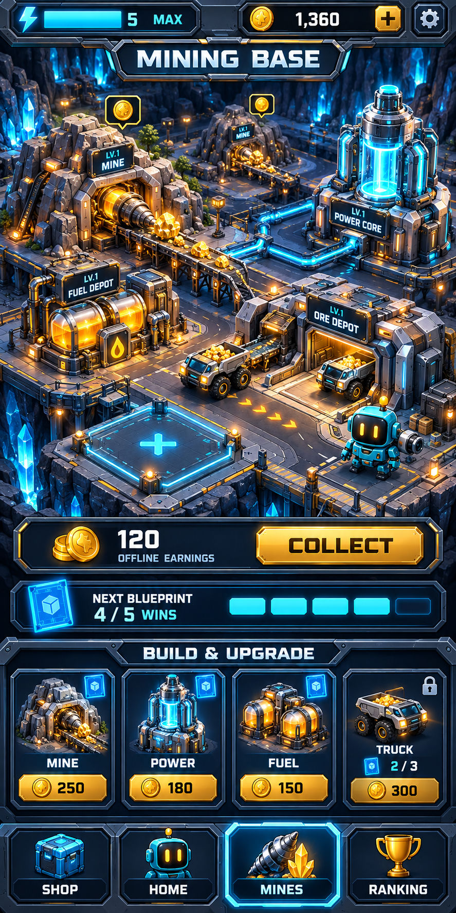

# Robot Pulse — concepto de zona minera

Fecha: 9 de octubre de 2026.

Diseño conceptual solicitado por el propietario. Generado con la herramienta integrada image_gen y mostrado directamente en el chat. No está integrado ni programado en la aplicación 0.5.0.

## Propuesta visual

- Minas que extraen mineral y generan monedas del juego durante la partida y mientras la aplicación está cerrada.
- Núcleo de energía, depósitos de combustible, almacén y camiones de transporte conectados dentro de una pequeña colonia.
- Plataformas vacías para ampliar la base con nuevas construcciones.
- Panel para recoger las monedas acumuladas.
- Tarjetas o planos ganados al superar niveles que desbloquean tipos de construcciones; después se construye o mejora con monedas.
- Catálogo inferior con Mina, Energía, Combustible y Camión, y pestaña Mines seleccionada en la navegación.

Los precios, la cantidad recolectada y la frecuencia de cinco victorias son ejemplos visuales, no reglas aprobadas ni un balance definitivo. Falta definir producción por edificio, dependencia de energía y combustible, capacidad de almacenamiento, límite de acumulación sin conexión y frecuencia de tarjetas. El camión bloqueado en el catálogo puede representar una unidad adicional; el mundo ya muestra transporte existente.

La propuesta es una imagen compuesta. Para programarla habrá que separar terreno, edificios, camiones, efectos, tarjetas y controles, conservando textos y contadores como elementos de interfaz traducibles.

[Prompt de generación](prompt.txt).
