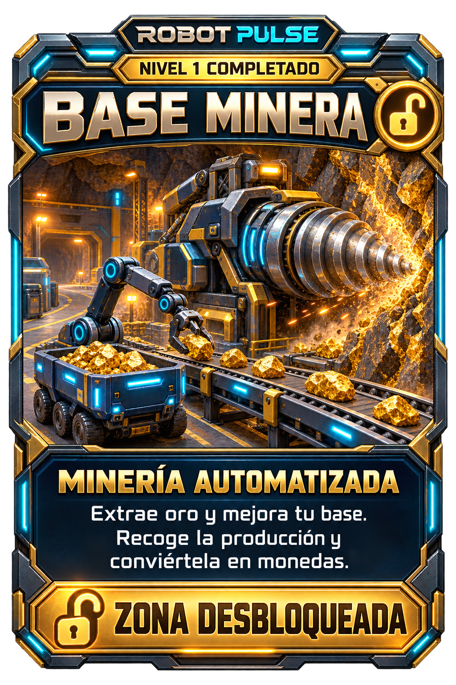

# Carta de desbloqueo — Base minera

Propuesta visual solicitada por el usuario: carta de recompensa al completar el primer nivel que abre la sección minera. Versión española, marca Robot Pulse en inglés. Generada con la herramienta integrada de imágenes; pendiente de aprobación e integración en la aplicación.

## Texto

- ROBOT PULSE
- NIVEL 1 COMPLETADO
- BASE MINERA
- MINERÍA AUTOMATIZADA
- Extrae oro y mejora tu base. Recoge la producción y conviértela en monedas.
- ZONA DESBLOQUEADA

## Dirección de generación

Una carta coleccionable original, vertical 2:3, frontal, completa, con marco futurista de titanio azul oscuro, iluminación cian y remates dorados. Jerarquía de carta de recompensa: marca, nivel superado, título de la zona, ilustración principal grande, explicación legible y placa inferior de desbloqueo. Ilustración estilizada de alta calidad: mina robótica en una cueva con vetas doradas, gran taladro helicoidal montado contra la pared, cinta con mineral, brazo de carga y vagón lleno al lado. Sin humanos. Mantener los textos españoles anteriores exactamente. Inspiración general de cartas coleccionables de batalla, con diseño propio de Robot Pulse y sin estadísticas de combate.

El archivo es el diseño gráfico completo para revisión. No modifica la lógica de recompensa ni la aplicación.
