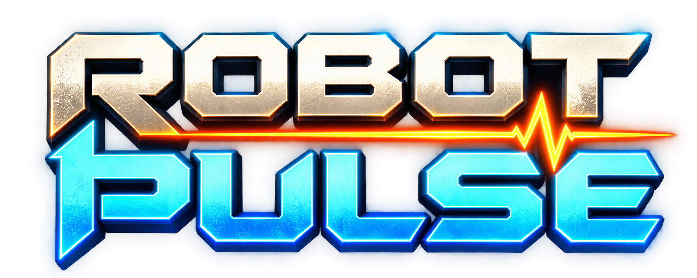
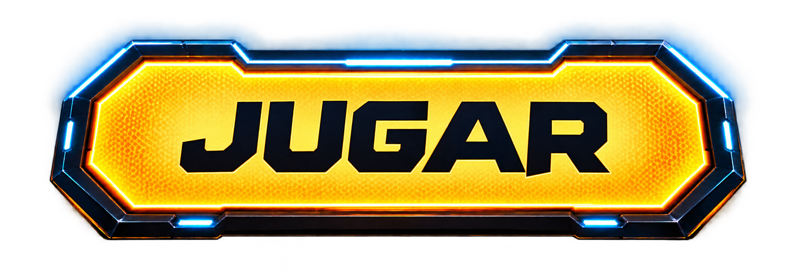
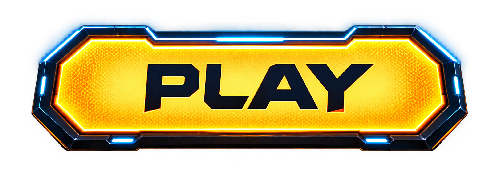

# Título y botones de Robot Pulse

Recursos gráficos separados, generados el 9 de octubre de 2026 a partir de la presentación aprobada que adjuntó el propietario. Herramienta: imagegen integrada, modo edición. Se conservan los PNG originales con alfa; no se han recortado ni reescalado.

| Archivo | Tamaño | Uso |
| --- | --- | --- |
| [robot-pulse-title.png](robot-pulse-title.png) | 1983 × 793 | Título ROBOT PULSE, siempre en inglés |
| [button-jugar-es.png](button-jugar-es.png) | 2119 × 742 | Botón en español |
| [button-play-en.png](button-play-en.png) | 2119 × 742 | Botón en inglés |

Los tres archivos tienen fondo transparente, sombras y luces en el canal alfa. Las dos versiones del botón tienen las mismas dimensiones de lienzo. Son recreaciones mediante edición generativa de la referencia: no se afirma identidad píxel a píxel. El botón JUGAR se generó editando el PNG PLAY para conservar el diseño.

## Idioma

El nombre y título ROBOT PULSE permanecen siempre en inglés. Los botones y demás textos de interfaz se traducen según el idioma seleccionado.

## Estado

Entrega de arte para revisión. Esta solicitud no modifica el código del juego ni genera otro APK. La integración y la corrección visual de la aplicación quedan pendientes.

[Prompts utilizados](prompts.md)

