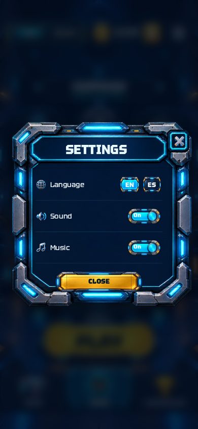
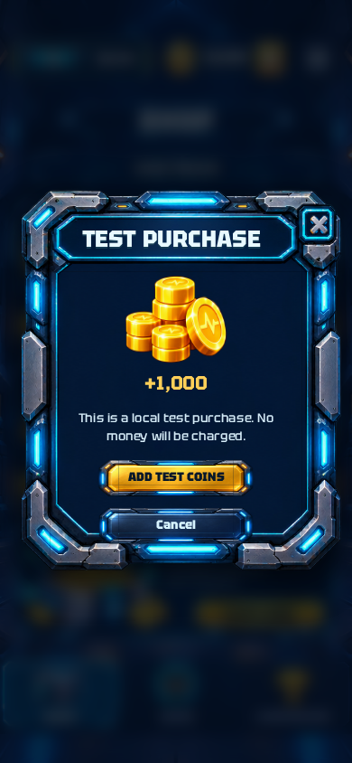
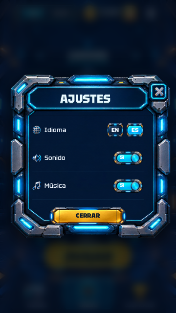

# Robot Pulse 0.7.1 — botones de ventanas y Settings

Corrección limitada a la revisión del propietario del 10 de octubre de 2026:

- Botones de acción amarillos y azules de las ventanas al 65% de su ancho anterior: reducción horizontal del 35%, centrada.
- Se conserva la altura de 51 píxeles de diseño y el grosor de los marcos ilustrados.
- El ajuste incluye acciones inferiores, suministro diario y recarga dentro de las ventanas.
- Settings contiene idioma, sonido y música. Se elimina la fila informativa Energy; el botón Close sube y el marco se adapta al contenido más corto.
- Los textos largos se distribuyen en dos líneas; el rótulo de recarga usa un tamaño que cabe dentro del marco.

La batería general, la jugabilidad, el sonido, la mina y el progreso permanecen como en 0.7.0. Paquete y certificado Android conservados; versión 0.7.1, código 8.

## Entrega verificada

[Descargar RobotPulse-0.7.1.apk](https://github.com/manureymar/Juego-nuevo/raw/refs/heads/main/downloads/RobotPulse-0.7.1.apk). Instalar encima de 0.7.0 conserva el progreso.

- Compilación y recorrido Android aprobados: [ejecución 38095261983](https://github.com/manureymar/Juego-nuevo/actions/runs/38095261983).
- Código probado: `92b135cdc2eebe9381469901eeab5a5094d7d45c`.
- APK: 97.886.495 bytes; versión Android `0.7.1-preview`, código 8.
- SHA-256: `98f24212e185ee6d66beb6cdb271c05c2cc92f2fe90bd723812eb0256c635e7b`.
- Se mantiene el certificado de las versiones anteriores: [firma verificada](android/apk-signature.txt).

Pasaron las pruebas de lógica, minería y recorrido del juego en navegador, los [88 casos de ventanas en EN/ES](review/results.json) y el [recorrido del APK instalado en Android 15 sin conexión](android/results.json). Este último incluye menús, sonido, partida, carta, arrastre, construcción, un minuto real de producción, recogida y guardado tras cerrar y reabrir la app.

El emulador utiliza Mesa/Lavapipe para evitar los cierres del proceso gráfico de la configuración anterior. La prueba de persistencia espera la señal nativa de pausa y el guardado antes de forzar el cierre; valida victorias, monedas y construcción al reabrir. Estas correcciones están en las pruebas y no alteran el juego.

## Capturas de las ventanas

| Settings | Compra |
| --- | --- |
|  |  |
|  |  |

[Captura de pausa en el APK instalado](android/13-pause.png).
