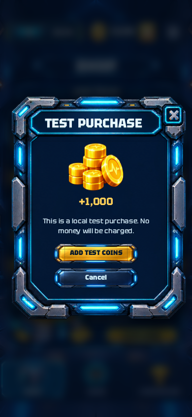
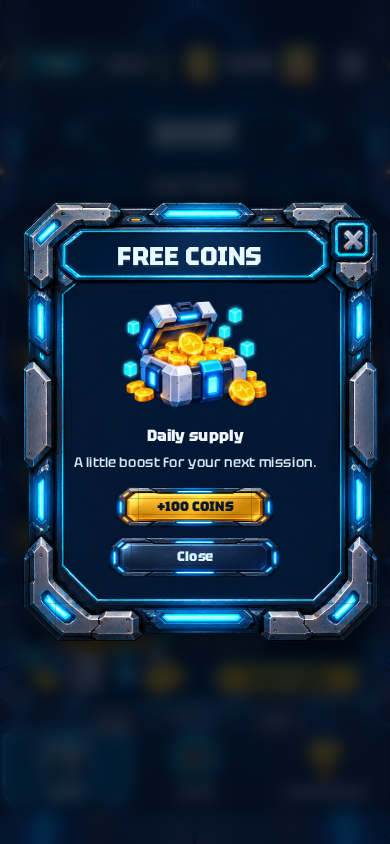
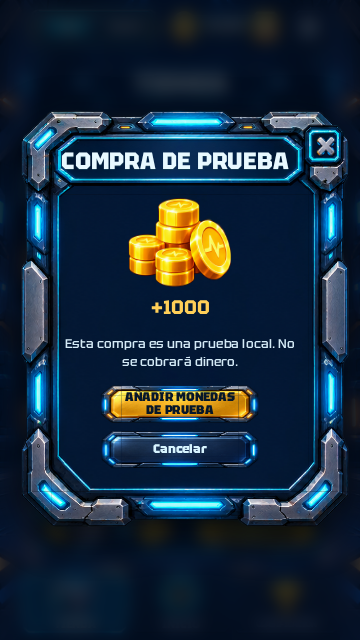

# Robot Pulse 0.7.2 — margen inferior de las ventanas

Revisión solicitada a partir de las capturas de compra y suministro diario:

- Los botones de acción quedan por encima de toda la zona decorativa inferior, con espacio libre antes de la línea cian.
- El botón amarillo sube conservando su separación respecto al texto.
- Cancelar y Close suben un poco más, reduciendo el espacio entre las acciones.
- Se conservan el ancho al 65%, la altura de 51 píxeles de diseño y los marcos originales de los botones.
- El ajuste se aplica a las ventanas compartidas, incluidos Settings, energía, compras, recompensas y pausa.

La comprobación de geometría utiliza la posición real del pie decorativo para evitar que los controles vuelvan a invadirlo. Versión Android 0.7.2, código 9; misma firma de actualización.

## Entrega verificada

[Descargar RobotPulse-0.7.2.apk](https://github.com/manureymar/Juego-nuevo/raw/refs/heads/main/downloads/RobotPulse-0.7.2.apk). Instalar encima de 0.7.1 conserva el progreso.

- Compilación y recorrido Android aprobados: [ejecución 38101470046](https://github.com/manureymar/Juego-nuevo/actions/runs/38101470046).
- Código probado: `47f656472f832ee856dbb33f3a06163548b5cfc0`.
- APK: 97.886.567 bytes; versión Android `0.7.2-preview`, código 9.
- SHA-256: `a6bad5955666d19c6218cfc99025151424e11e2078138f32beda58366a662668`.
- Se mantiene el certificado de las versiones anteriores: [firma verificada](android/apk-signature.txt).

Pasaron las pruebas de lógica, minería y recorrido del juego en navegador, los [88 casos de ventanas en EN/ES](review/results.json) y el [recorrido del APK instalado en Android 15 sin conexión](android/results.json). Este último incluye menús, sonido, partida, carta, arrastre, construcción, producción, recogida y guardado tras cerrar y reabrir la app.

El cambio de disposición reserva 92 píxeles de diseño al pie de la ventana, cubriendo los 64 del marco decorativo y dejando 28 adicionales. Se reduce la separación entre acciones a 7 píxeles de diseño, conservando la distancia del texto al primer botón. La comprobación de geometría exige espacio por encima del pie real, también al escalar la ventana.

## Capturas de las ventanas

| Compra | Monedas gratis |
| --- | --- |
|  |  |
|  |  |

[Settings](review/settings-en-390.png) · [Captura de pausa en el APK instalado](android/13-pause.png).
