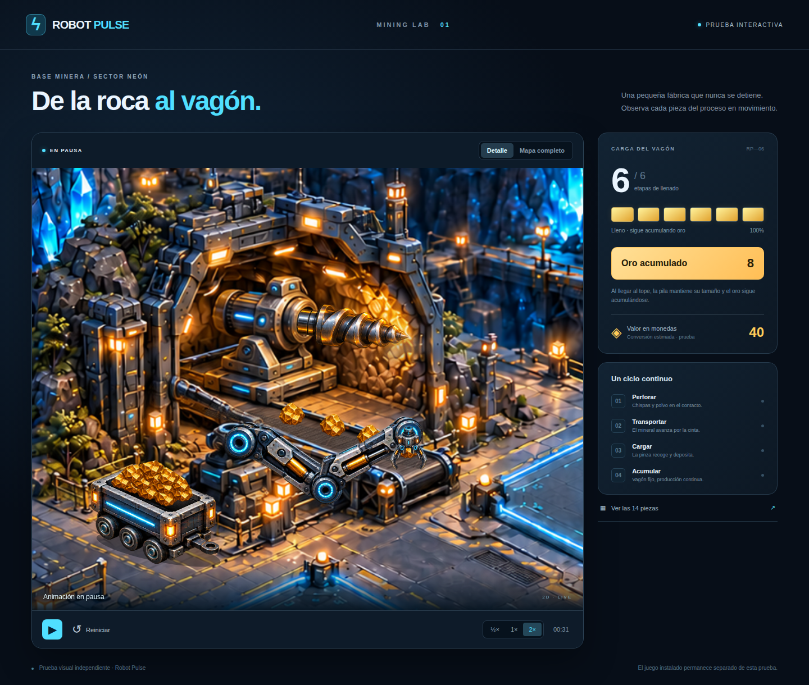
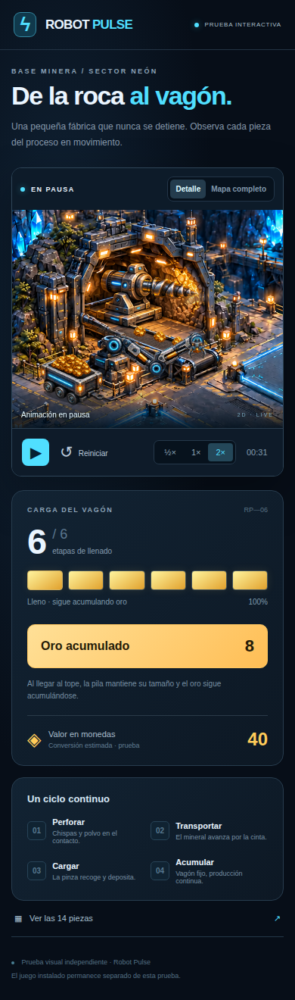
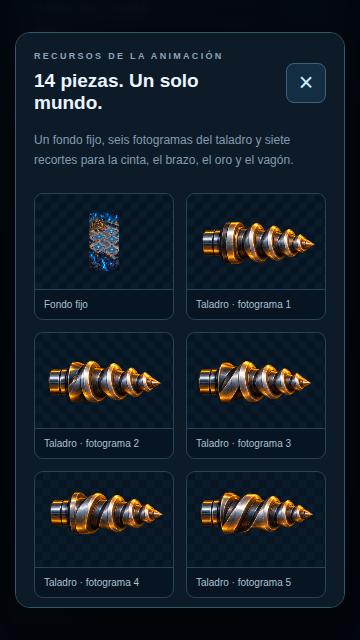

# Robot Pulse — prueba de animación minera

[ABRIR LA PRUEBA WEB](https://raw.githack.com/manureymar/Juego-nuevo/9de29ba715f24168f10d9bbc1e374f5acc2fdfa1/previews/mining/index.html)

[Código y recursos](../../previews/mining/) · [Flujo de comprobación](https://github.com/manureymar/Juego-nuevo/actions/runs/38009021453)

Revisión del 10 de octubre de 2026: ráfagas irregulares de chispas, direcciones y tamaños variados, resistencia al aire, gravedad y nubes asimétricas de polvo; vagón estacionado, pila visual limitada y oro acumulado independiente. Se conserva el resto de la escena y sus recursos. La prueba sigue separada de la aplicación Android.

## Uso

La animación empieza al cargar las imágenes. Puedes pausarla, reiniciarla, cambiar entre ½×, 1× y 2×, alternar detalle/mapa o abrir la galería de las 14 piezas.

El taladro gira contra la pared fija. Las chispas, motas y polvo se dibujan con código junto al punto de contacto, sin modificar la pared. La cantidad cambia entre momentos suaves, medios e intensos. Cada partícula tiene una velocidad, tamaño, duración y resistencia al aire propios. Los fragmentos caen bajo gravedad y pueden rebotar en la repisa perdiendo energía; las estelas son cortas y desiguales. El polvo pesado se asienta y el fino deriva, se expande y se disipa en nubes de forma irregular. El límite de 180 partículas y la caché reciente mantienen acotada la memoria. Las piedras aparecen sobre la cinta y la pinza las deposita en el vagón.

El vagón permanece inmóvil y se llena hasta el borde en seis etapas visuales. Una vez lleno, la pila conserva exactamente su tamaño y posición, pero la pinza sigue cargando. Cada depósito aumenta el contador de oro una sola vez. El valor en monedas es una estimación de prueba (cinco por unidad), no una recogida ni un saldo ya convertido.

Se revisó el video de referencia de 12,5 segundos: la emisión anterior mantenía una densidad y dirección demasiado uniformes. Esta revisión cambia solo los efectos del contacto.

El enlace utiliza los archivos del commit `9de29ba715f24168f10d9bbc1e374f5acc2fdfa1`. El servicio de previsualización puede pedir confirmar el destino la primera vez que se abre una página HTML.

## Verificación

- Siete pruebas de lógica: identidad de piedras y articulaciones, producción continua con pila limitada y vagón fijo, crédito al depositar, emisión variable, direcciones distintas, resistencia al aire y gravedad, colisiones, nubes asimétricas y reproducción determinista y reinicio.
- Recorrido en Chromium a 1440 × 1050, 390 × 844 y 360 × 640: controles, pausa de toda la escena, llenado, crecimiento posterior del oro, mapa y galería.
- Comparación de píxeles del vagón lleno antes y después de continuar produciendo: idénticos.
- Enlace público y recursos HTML, CSS, JavaScript y PNG comprobados.

La futura recogida mediante camiones, conversión definitiva, guardado y acumulación offline quedan para la integración posterior. La pestaña oculta pausa esta prueba.

## Capturas reales

| Teléfono | Galería de recursos |
| --- | --- |
|  |  |

Comparación de las ráfagas en teléfono: [intensa](particles-intense.png), [media](particles-medium.png) y [suave](particles-quiet.png).

[Resultados del navegador](browser-results.json). Las capturas están pausadas; la página comienza animada.
