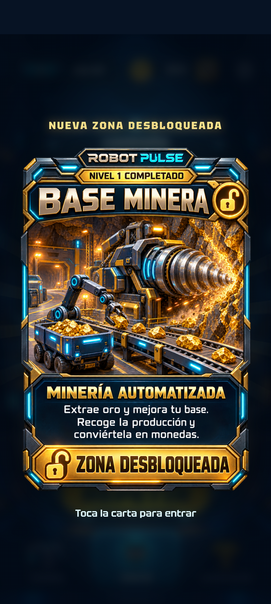
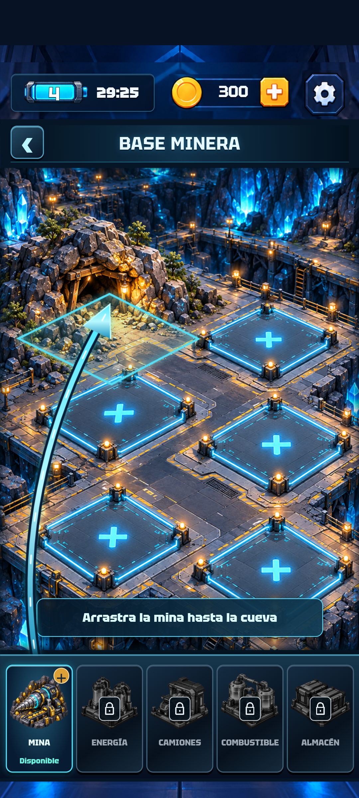
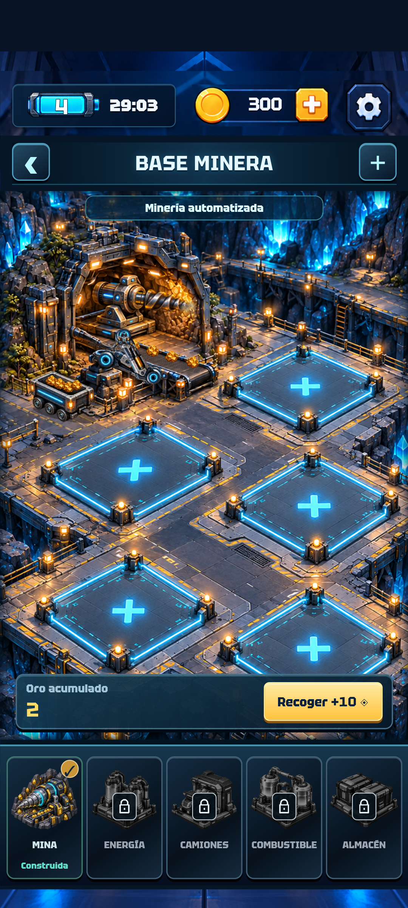
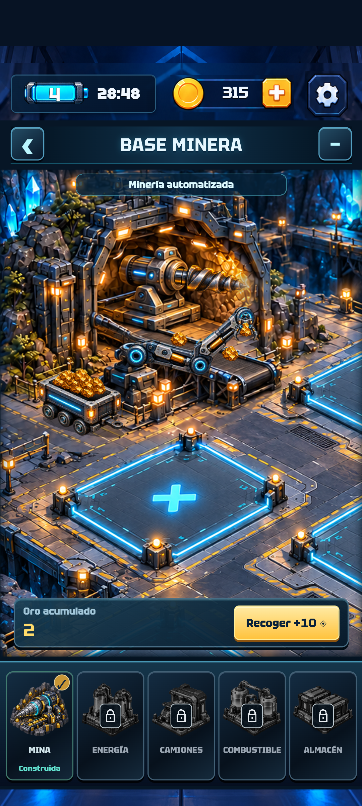
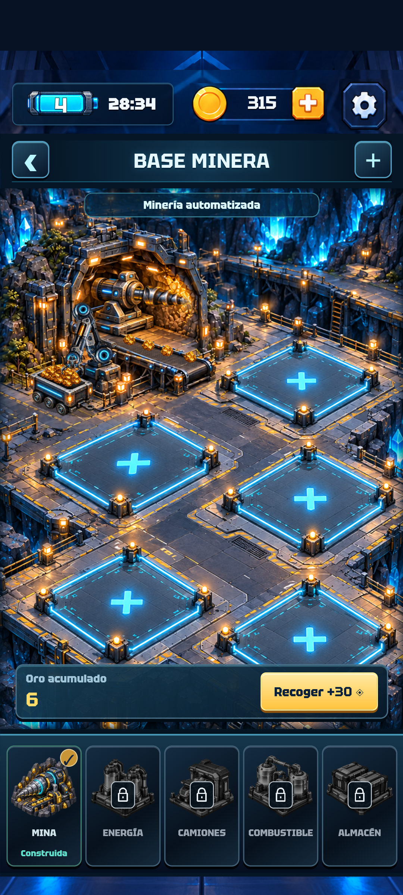
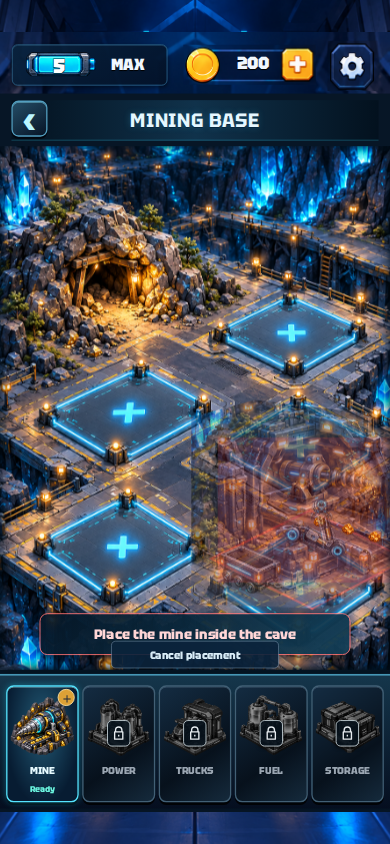
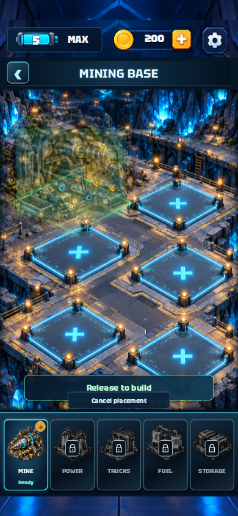
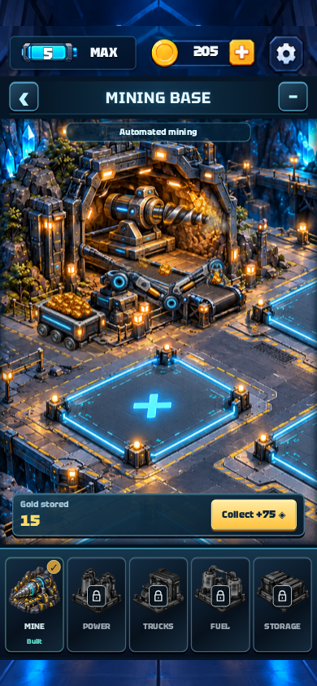

# Robot Pulse 0.6.0 — entrega verificada

10 de octubre de 2026. [Descargar APK](../../downloads/RobotPulse-0.6.0.apk) · [Instalación](../ANDROID.md) · [Diseño y funcionamiento](../MINING-0.6.0.md).

Ejecución final: [GitHub Actions 38019129498](https://github.com/manureymar/Juego-nuevo/actions/runs/38019129498), aprobada. Código: `b68d3c26b9c62b1679058540b7ed2f8987fd0c9c`. APK guardado por la compilación en `65b4ebbfd73aea289f58377ab3ebdd7a4d93bf3d`.

## Qué se comprobó

- 28 pruebas deterministas del puzle, batería, economía, migración del guardado, desbloqueo, construcción, producción offline, recogida única y vagón inmóvil.
- 88 casos de ventanas y controles en inglés y español. [Resultados](dialog-results.json).
- Victoria del nivel 1 con entradas reales, carta, navegación y todas las pantallas existentes. [Resultados web](browser-results.json).
- Arrastre táctil válido e inválido, cancelación, encaje, construcción, producción, recogida, zoom y persistencia; tamaños 360 × 640, 390 × 844 y 412 × 915. [Resultados de minería](mining-browser-results.json).
- APK instalado en Android API 35, sin wifi ni datos; fuentes de sistema al 140 %. Toques y arrastre nativos mediante ADB. Se verificaron la carta de una partida anterior, la construcción, el aumento de monedas al recoger, el zoom, la mina conservada tras recargar y Android Atrás. Vista WebView: 412 × 863, DPR 2,625. Sin errores JavaScript ni ANR de Robot Pulse. [Resultados Android](android-results.json).

La primera ejecución detectó una escritura innecesaria al recargar; se corrigió. La siguiente llegó a construir la mina en Android, pero perdió la conexión con el emulador durante las consultas de UIAutomator. La entrega final evita consultas repetidas a la misma ventana nativa y cambios repetidos de textos que no han variado; el recorrido completo terminó correctamente. El motor, las partículas y el arte de la animación minera aprobada permanecen iguales.

## APK

Archivo: `RobotPulse-0.6.0.apk`, 93.709.571 bytes. Paquete `com.manureymar.robotpulse.preview`, versión `0.6.0-preview`, código 6. Android mínimo API 26; objetivo 35. [Información de paquete](apk-info.txt).

SHA-256:

```text
e9a58eb4c41c91e703277aab5d25cb11369dd424bab027e90cf2dab64eea608f
```

Certificado SHA-256: `7cd69261b62da3dfd299116a44f25466866f183ff802fa88630ac2dc0b8c5856`, igual al de 0.5.0. La firma se verificó con apksigner. Instalar encima de 0.5.0 conserva el almacenamiento de la aplicación.

## Capturas reales de Android

| Carta ganada | Base vacía |
| --- | --- |
|  |  |

| Mina construida | Vista cercana | Después de reabrir |
| --- | --- | --- |
|  |  |  |

## Colocación en navegador

| Zona incorrecta | Encaje correcto | Vagón lleno |
| --- | --- | --- |
|  |  |  |

[Carta en inglés](unlock-card-en.png) · [Carta en español](unlock-card-es.png) · [Base vacía](empty-base.png).
