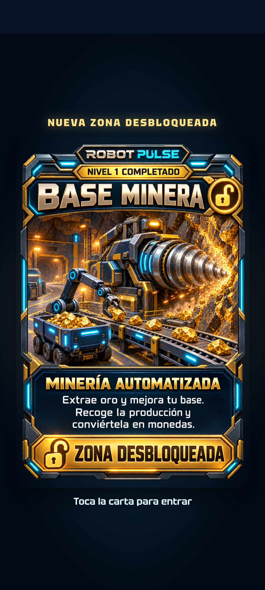
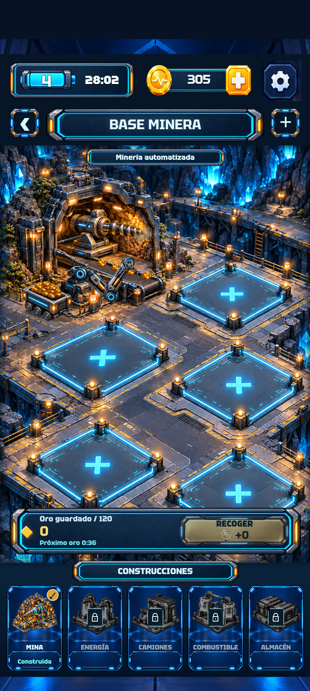

# Robot Pulse 0.7.0 — diseño, sonido y minería

[Lista de las 19 correcciones](../UI-0.7.0.md) · [Instalación en Android](../ANDROID.md)

**APK 0.7.0 publicado y verificado:** [descarga directa](https://github.com/manureymar/Juego-nuevo/raw/refs/heads/main/downloads/RobotPulse-0.7.0.apk). Instalar encima de 0.5.0 o 0.6.0 conserva el progreso.

## Capturas de la aplicación

Estas imágenes son capturas del juego funcionando, no propuestas de diseño.

| HOME y portal | Mina construida |
| --- | --- |
|  |  |

| Ajustes | Victoria sin hueco de cierre |
| --- | --- |
|  |  |

| Carta digitalizándose | Montaje con energía |
| --- | --- |
|  |  |

## Pruebas

Revisión final de navegador, compilación e instalación Android superada: [ejecución 38030357180](https://github.com/manureymar/Juego-nuevo/actions/runs/38030357180). Código probado: `c14f93c0948df67dc772dd87b100c124cf5e21a2`. APK y capturas publicados en `e25feca1b365e050735794c349e7b8b3470d8971`.

- 29 pruebas de lógica: nivel, economía, energía, guardado y migración del oro existente.
- 88 casos de ventanas y distribución en inglés y español.
- Recorrido jugable: victoria real del nivel, herramientas, pausa, recuperación de la partida, compra simulada, sonido y volumen.
- Minería: arrastre válido e inválido, cancelación, construcción, producción, recogida, restauración, idiomas y movimiento reducido.
- Los resultados estructurados están en `review/browser-results.json`, `review/dialogs/results.json` y `review/mining/results.json`.

## APK instalado en Android

Prueba sin conexión en Android 15, pantalla de 412 × 863 píxeles CSS y escala de fuente del sistema 1,4. Se comprobaron menús EN/ES, seis paquetes simulados, batería, ajustes, navegación, disparos, pausa, música, WAV de botones, carta, arrastre con gesto nativo, construcción, un minuto real de producción, recogida, acercamiento, restauración del progreso y botón Atrás. No se registraron errores de la aplicación. [Resultado estructurado](android/results.json).

| Carta en Android | Mina guardada y restaurada |
| --- | --- |
|  |  |

El entorno de pruebas fija Android Emulator 36.3.10. La versión 37.2.12 sufría un cierre del proceso QEMU del anfitrión durante este recorrido, confirmado por su volcado de error. Con la versión fijada pasó el recorrido completo, incluidas las animaciones de la carta (`prefers-reduced-motion: false`).

- Versión: `0.7.0-preview`, código Android `7`.
- Paquete: `com.manureymar.robotpulse.preview`.
- Tamaño: 97.886.383 bytes (93,35 MiB).
- SHA-256 del APK: `a8fd476face89f1b2b26e5ec34f59e033d515138d18e25613ebb37124ff23e49`.
- Certificado SHA-256 conservado: `7cd69261b62da3dfd299116a44f25466866f183ff802fa88630ac2dc0b8c5856`.
- [Verificación de firma](android/apk-signature.txt) · [Paquete y requisitos](android/apk-info.txt).
