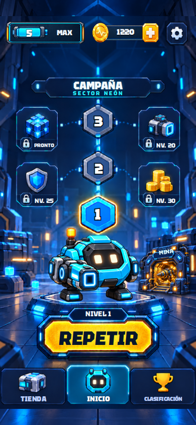
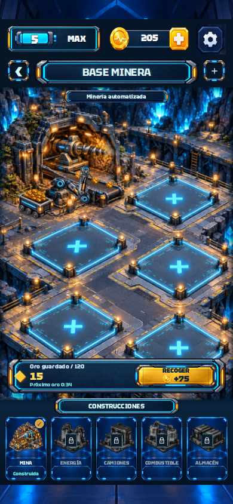
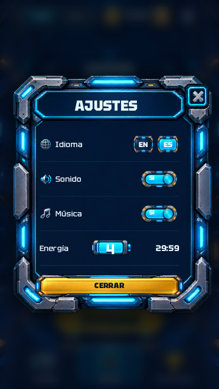
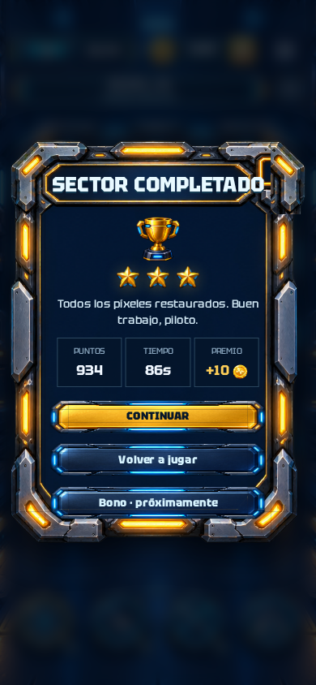
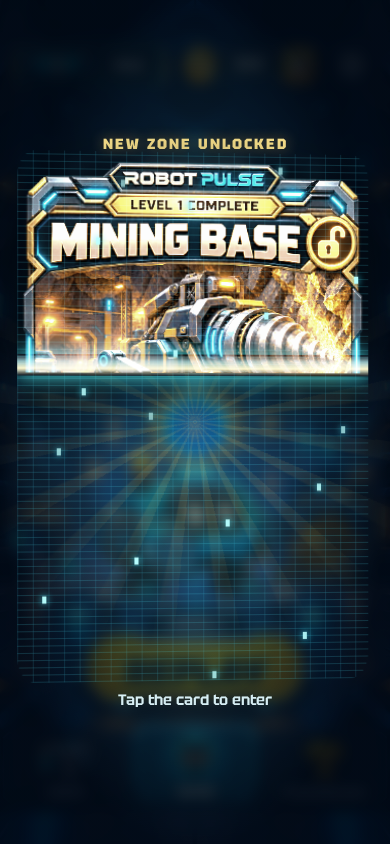
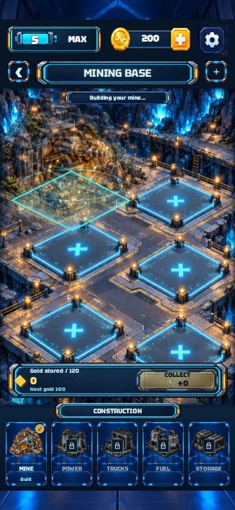

# Robot Pulse 0.7.0 — diseño, sonido y minería

[Lista de las 19 correcciones](../UI-0.7.0.md) · [Instalación en Android](../ANDROID.md)

## Capturas de la aplicación

Estas imágenes son capturas del juego funcionando, no propuestas de diseño.

| HOME y portal | Mina construida |
| --- | --- |
|  |  |

| Ajustes | Victoria sin hueco de cierre |
| --- | --- |
|  |  |

| Carta digitalizándose | Montaje con energía |
| --- | --- |
|  |  |

## Pruebas

Revisión visual y funcional superada: [ejecución 38026513332](https://github.com/manureymar/Juego-nuevo/actions/runs/38026513332). Código revisado: `e319f6e279d978fae32542bbc8134516274ceb6c`.

- 29 pruebas de lógica: nivel, economía, energía, guardado y migración del oro existente.
- 88 casos de ventanas y distribución en inglés y español.
- Recorrido jugable: victoria real del nivel, herramientas, pausa, recuperación de la partida, compra simulada, sonido y volumen.
- Minería: arrastre válido e inválido, cancelación, construcción, producción, recogida, restauración, idiomas y movimiento reducido.
- Los resultados estructurados están en `review/browser-results.json`, `review/dialogs/results.json` y `review/mining/results.json`.

La entrega del APK queda condicionada a la prueba de instalación en Android y a la comprobación del certificado. El informe final de esa ejecución se añadirá aquí al completar la publicación.
