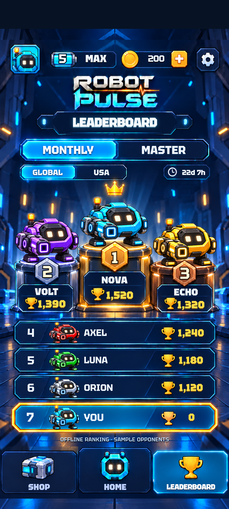
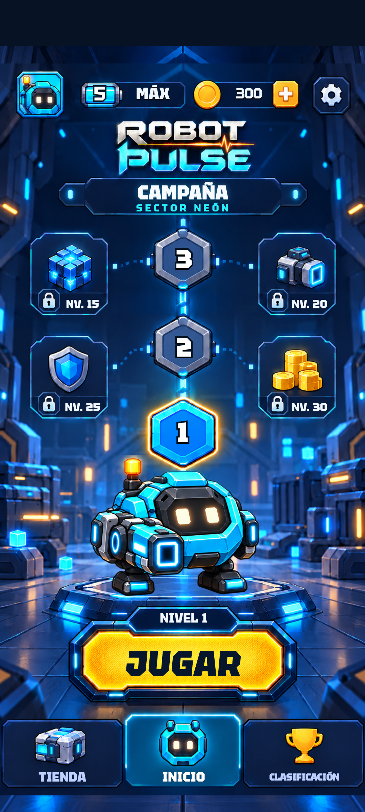
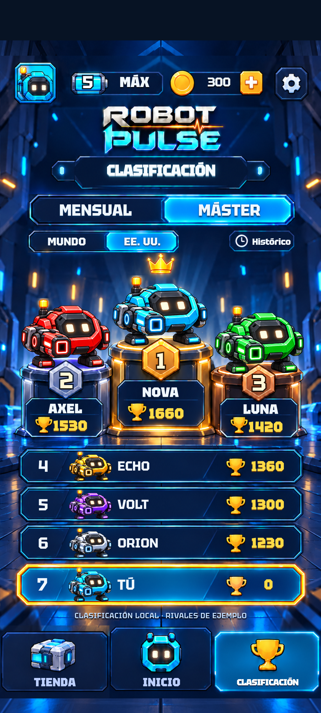
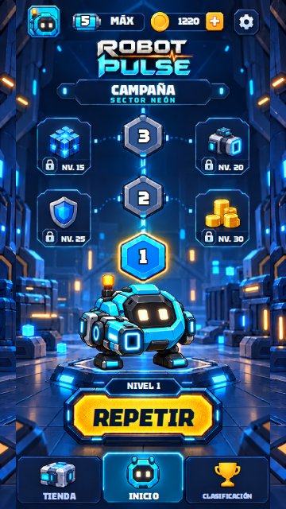
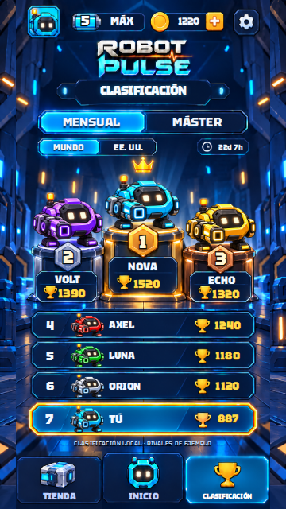

# Capturas reales — Robot Pulse 0.3.0

Estas capturas proceden de la app compilada y de sus pruebas de navegador; no son nuevos diseños generados.

## Home, APK instalado en Android

## Leaderboard, APK instalado en Android

## Español en Android

## Teléfono pequeño, 360 × 640

[Pruebas Android](results.json) · [Pruebas navegador](browser-results.json) · [Verificación](../VERIFICATION.md)
