# Capturas reales — Robot Pulse 0.5.0

Estas imágenes proceden del juego ejecutado en Chromium y del APK instalado en el emulador Android. No son conceptos generados ni pantallas simuladas.

Código de la compilación: `ff0dec277a736bbcbe2428bfad9b51bcb4a51af2`.

[Compilación y pruebas](https://github.com/manureymar/Juego-nuevo/actions/runs/37990426447) · [Informe](../VERIFICATION.md) · [Vídeo de disparos, impactos y avance de robots](level-01-motion.mp4)

Las capturas usan un perfil de prueba para abrir todas las ventanas. Sus monedas y batería no representan el saldo inicial de la aplicación.

## Pantallas y nivel

| Home sin logotipo ni avatar | Nivel 1 con pista ampliada |
| --- | --- |
| 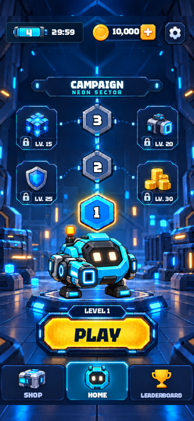 | 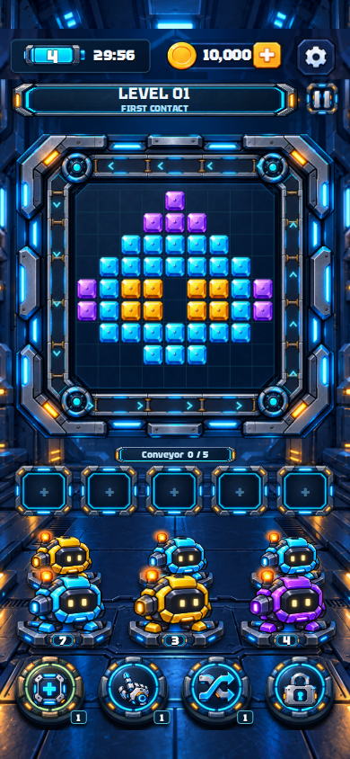 |

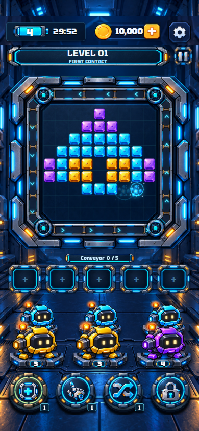

## Ventanas corregidas

| Ajustes en español, 360 × 640 | Pausa, 360 × 640 | Compra de prueba en español |
| --- | --- | --- |
| 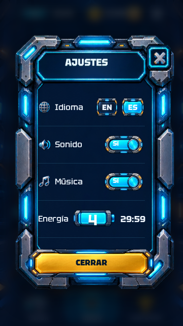 | 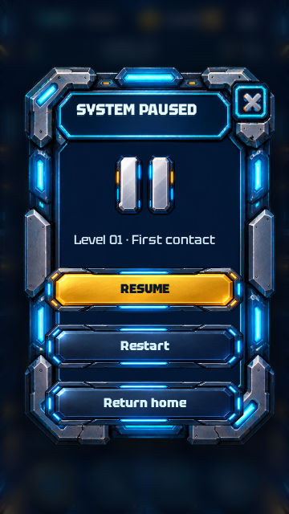 | 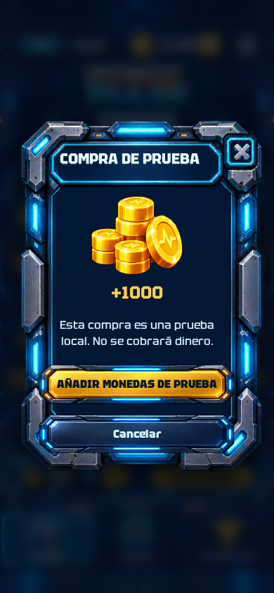 |

| Recarga de batería | Monedas |
| --- | --- |
| 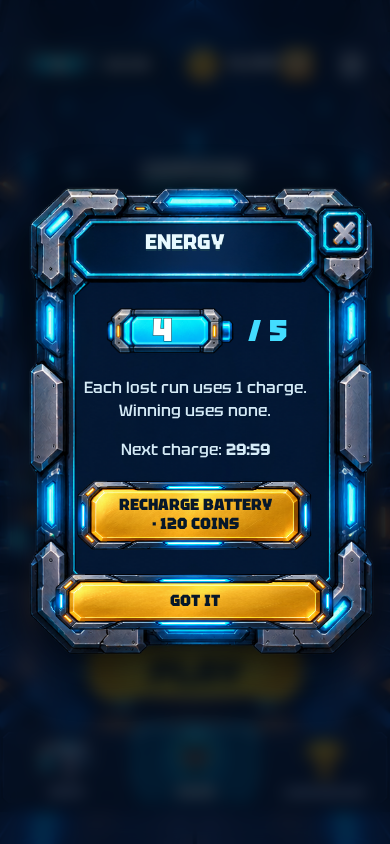 | 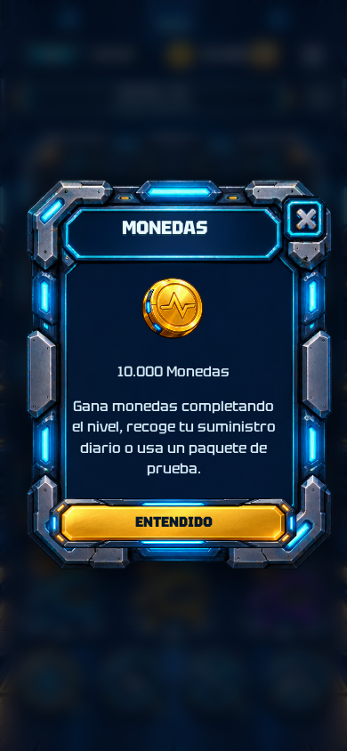 |

| Bandeja extra | Elegir robot | Mezclar colas |
| --- | --- | --- |
| 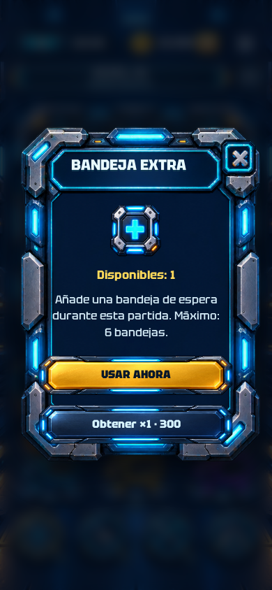 |  | 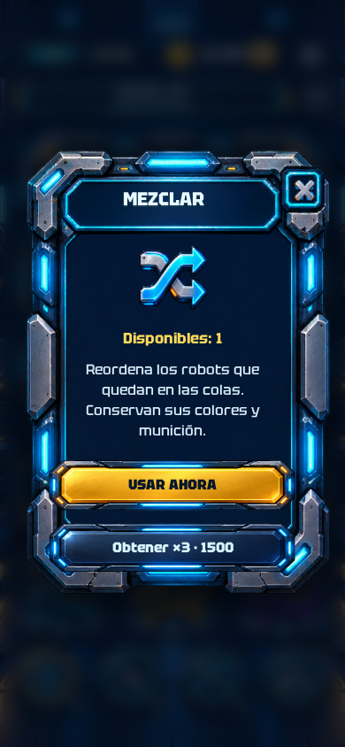 |

Los registros [de paneles](dialogs-results.json) y [del recorrido completo](browser-results.json) conservan los resultados automatizados. El vídeo muestra una partida real: los robots salen de las colas, recorren la pista y disparan hacia los bloques; la grabación no incluye audio.

## APK instalado en Android

Android 15, Pixel 7 emulado, WebView 412 × 863, fuente del sistema al 140 %, Wi-Fi y datos desactivados. [Resultados nativos](android-results.json).

| Nivel 1 | Pausa | Shop |
| --- | --- | --- |
| 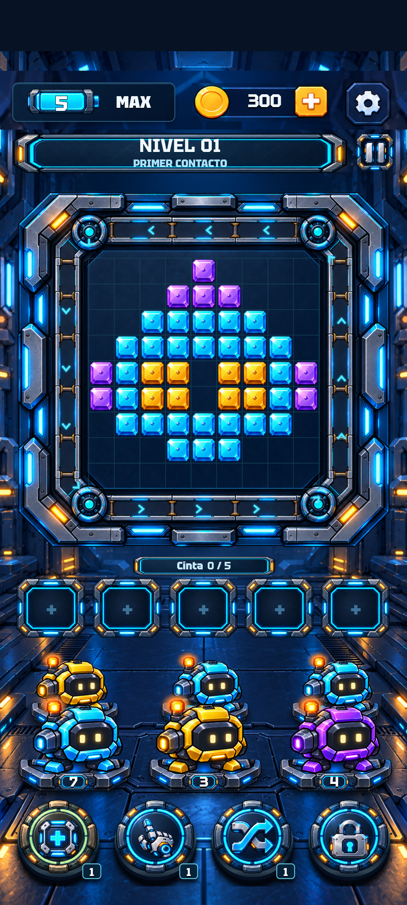 | 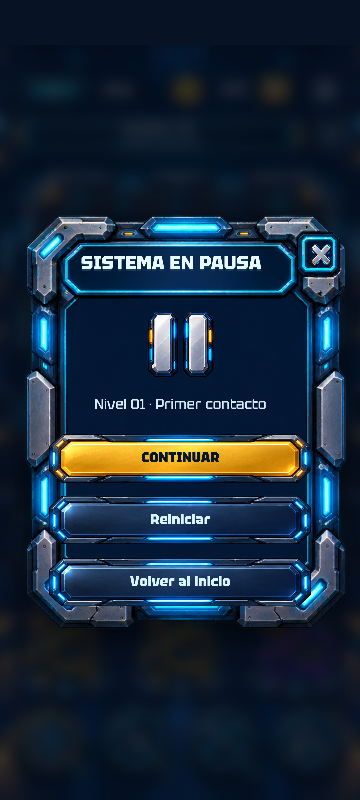 | 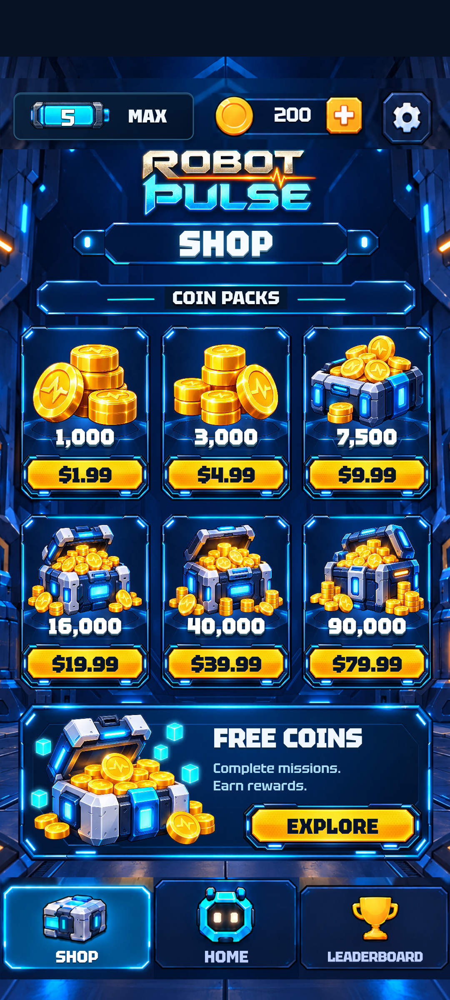 |
