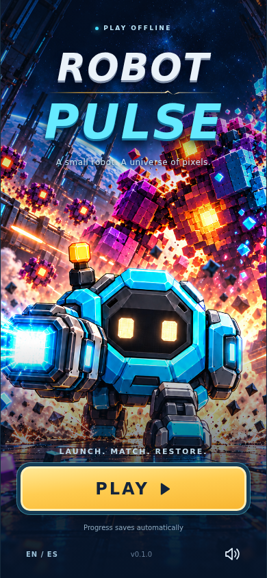
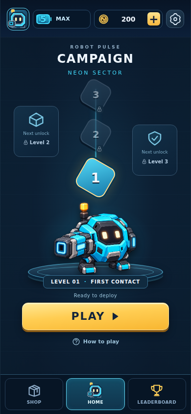
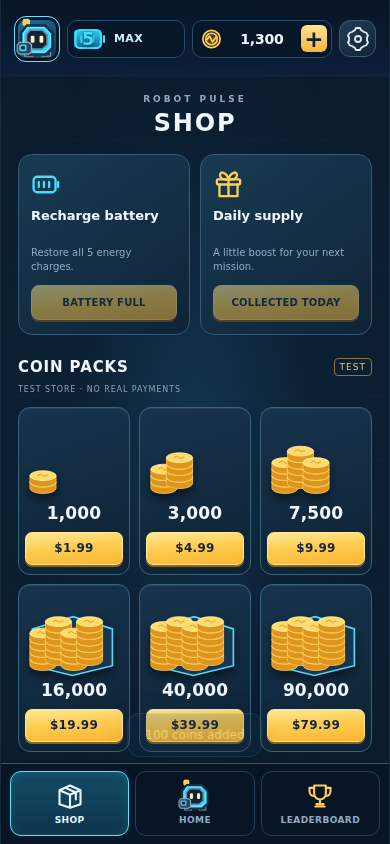
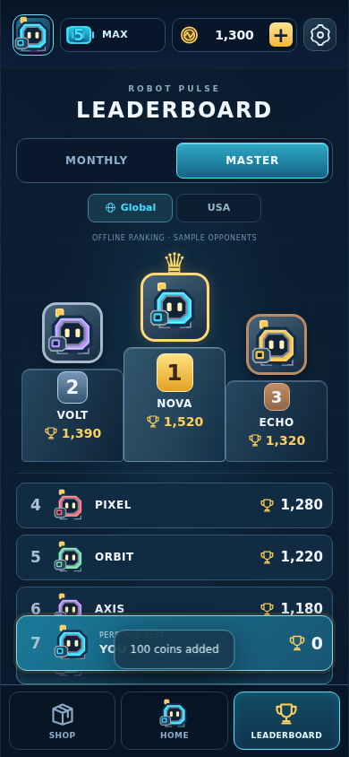
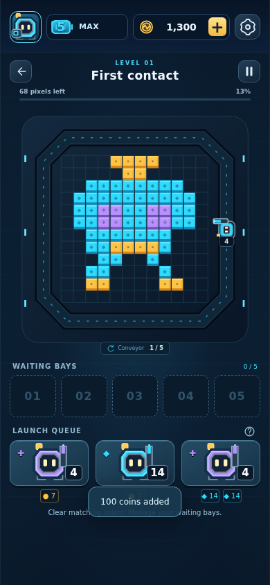
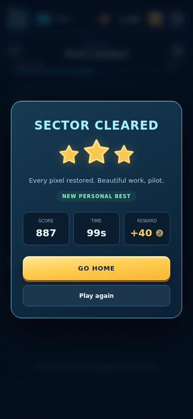
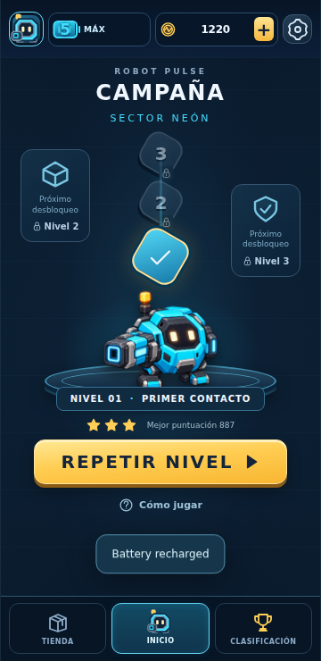

# Capturas de la aplicación funcional

Estas imágenes proceden del recorrido automatizado del juego en Chromium, con pantalla de 390 × 844 píxeles. La última usa 360 × 740 y la interfaz en español. Son capturas del código ejecutándose, no diseños conceptuales.

Código comprobado: `80cc1a10569ed086cce71e4a0474ec2129746b3d`. La corrección posterior `d25763a53d9db3025063dadf16571a7155fa3e68` solo añade la preparación de las herramientas de Android, sin cambiar el juego.

[Resultados del recorrido](browser-results.json) · [Ejecución de las pruebas visuales](https://github.com/manureymar/Juego-nuevo/actions/runs/37935031226)

| Apertura | Home |
| --- | --- |
|  |  |

| Shop | Leaderboard |
| --- | --- |
|  |  |

| Primer nivel | Victoria |
| --- | --- |
|  |  |

## Pantalla pequeña en español

Las capturas comprueban el diseño y las interacciones del juego. No sustituyen la prueba de instalación y ejecución en un teléfono físico.
